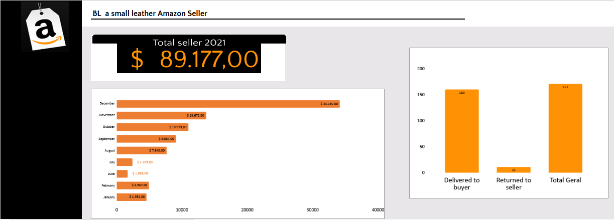

# BL Seller Dashboard - Amazon Sales & Returns Analysis

## Overview
This dashboard analyzes sales data from BL, a small leather goods company selling on Amazon. In recent months, the business faced losses due to order returns. This analysis visualizes sales performance and return status to support data-driven decisions.

## Tools
- Excel Online (dashboard)
- Public sales & returns dataset

## Key Insights
- **Total Revenue (2021)**: ₹ 89,177
- **Peak Month**: December (₹ 34,150 — 38% of annual revenue)
- **Return Rate**: 6.4% (11 out of 171 orders returned)
- **Top Product Type**: Handbags & Shoulder Bags

## Dashboard Preview

## Dataset
- [amazon_data.xlsx](./amazon_data.xlsx) — Sales transactions and return records (Excel file)
